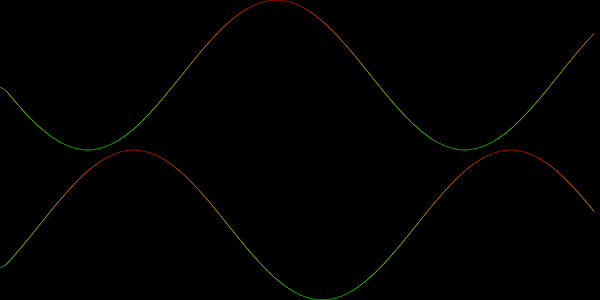

Liveplot
========

Live plotting with OpenGL. This Haskell library allows feeding live data via Pipes to
OpenGL plots.

Currently only 2D line plot is supported. Multiple plots can be run simultaneously,
layout description interface needs work though.

Requires
--------

- stack https://docs.haskellstack.org/en/stable/README/

Building
--------

::

        stack build
        stack exec liveplot # for demo app

Examples
--------

See `Graphics.Liveplot.Demo` for usage example.
